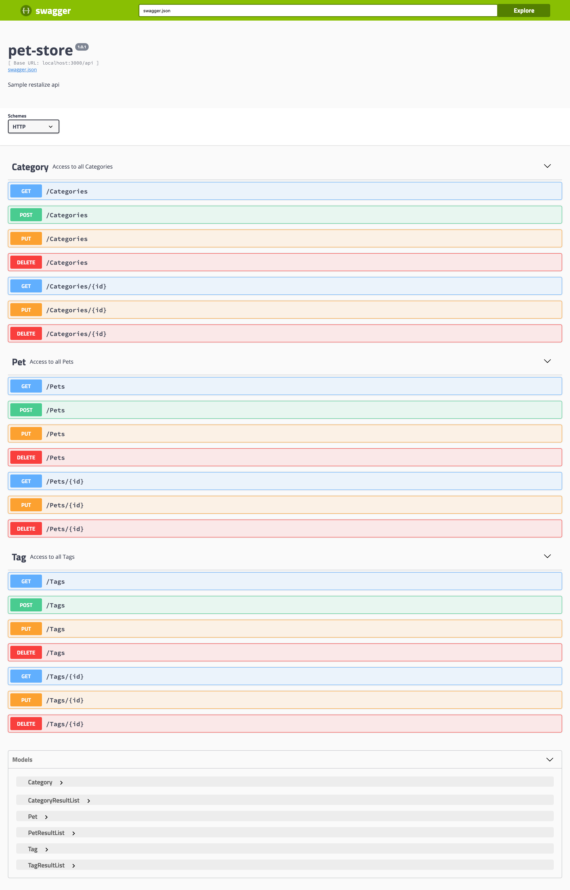

# Restalize Template

[](https://app.circleci.com/pipelines/gh/kennasoft/restalize) [](https://codecov.io/gh/kennasoft/restalize)

This is a helper module for [Restalize](https://github.com/kennasoft/restalize/tree/master/packages/restalize) REST API generator. It serves as a template for the REST API project generated by Restalize.

<!-- START doctoc generated TOC please keep comment here to allow auto update -->
<!-- DON'T EDIT THIS SECTION, INSTEAD RE-RUN doctoc TO UPDATE -->

- [Cloning and using the repo](#cloning-and-using-the-repo)
- [How to use the API:](#how-to-use-the-api)
  - [1. Getting all Entity instances](#1-getting-all-entity-instances)
  - [2. Getting entities with simple query parameters](#2-getting-entities-with-simple-query-parameters)
  - [3. Getting entities with more complex query parameters](#3-getting-entities-with-more-complex-query-parameters)
    - [3.1 REST API operators](#31-rest-api-operators)
    - [3.2 REST API response modifiers](#32-rest-api-response-modifiers)

<!-- END doctoc generated TOC please keep comment here to allow auto update -->

## Cloning and using the repo

Since this package belongs to a monorepo, cloning it alone means you need to use `git filter-branch` to remove unnecessary files:

```
git clone https://github.com/kennasoft/restalize.git
git filter-branch --subdirectory-filter packages/restalize-template
```

If you already have your typeorm entities/models defined (see examples at [tests/lib/entities](tests/lib/entities)), you can throw them in the directory [server/lib/entities](server/lib/entities), and you have yourself a basic CRUD (Create, Read, Update, Delete) REST API complete with Open API 2.0 (swagger) documentation. Remember to specify your own typeorm database connection details in a .env file (see `.env.sample`).

When you start the express or hapi server using `yarn dev` or `yarn dev:hapi` commands respectively, it generates 7 different API routes for each entity/model. For example, if you have an entity called `Pet`, you'll get the following endpoints:

```
- GET /api/Pets        # fetch a list of Pets based on request query params
- GET /api/Pets/:id    # fetch a single Pet based on the id path param
- POST /api/Pets       # create a single Pet based on JSON payload in request body
- PUT /api/Pets        # update a Pet or multiple Pets based on condition found in request payload
- PUT /api/Pets/:id    # update the Pet with id matching the id in request path using the update fields in the request body
- DELETE /api/Pets     # delete multiple Pets based on condition found in request payload
- DELETE /api/Pets/:id    # delete the Pet with id matching the id in request path
```

Apart from the routes listed above, you also get the `/api` route which lands on a swagger UI page listing all available endpoints

```
- GET /api # display the OpenApi UI to see all available endpoints
```

Which will give a page like this:


The GET request has some useful querying, sorting, and filtering features that can be used on the endpoint, which we'll look into in this document.

## How to use the API:

### 1. Getting all Entity instances

You can fetch all rows paginated (20 rows per page) by doing a simple get request to the /api/Pets endpoint without any query parameters. E.g. running the command below in a terminal

```
curl -X GET http://localhost:3000/api/Pets
```

will result in the following output:

```json
{
  "status": "success",
  "data": {
    "total": 5,
    "subtotal": 5,
    "rows": [
      {
        "name": "FuzzyCat",
        "photoUrls": [
          "http://loremflickr.com/g/320/240/cat",
          "http://loremflickr.com/320/240/cat"
        ],
        "status": "available"
      },
      {
        "name": "NaughtyDog",
        "photoUrls": [
          "http://loremflickr.com/g/320/240/dog",
          "http://loremflickr.com/320/240/dog"
        ],
        "status": "available"
      },
      {
        "name": "Spotty",
        "photoUrls": [
          "http://loremflickr.com/g/320/240/leopard",
          "http://loremflickr.com/320/240/leopard"
        ],
        "status": "available"
      },
      {
        "name": "King Kong",
        "photoUrls": [
          "http://www.sciencedump.com/sites/default/files/field/teaserimage/gorilla.jpg",
          "http://www.kidzone.ws/ANIMALS/gorillas/gorilla.jpg",
          "http://i.dailymail.co.uk/i/pix/2014/04/14/article-2604010-1D117C4D00000578-291_634x782.jpg",
          "http://i4.mirror.co.uk/incoming/article8084087.ece/ALTERNATES/s615/MAIN-Dublin-zoo-gorilla-dies-after-short-illness.jpg"
        ],
        "status": "available"
      },
      {
        "name": "Tyrannosaurus Rex",
        "photoUrls": [
          "http://vignette2.wikia.nocookie.net/jurassicpark/images/5/57/Jurassic-world-stomp-strike-tyrannosaurus-rex-1.jpg/revision/latest?cb=20150213174835",
          "http://orig03.deviantart.net/f652/f/2014/331/5/7/jurassic_world__tyrannosaurus_rex_by_sonichedgehog2-d87wp3n.png",
          "http://www.abc.net.au/news/image/7251586-3x2-940x627.jpg",
          "http://www.sideshowtoy.com/assets/products/200209-t-rex-the-tyrant-king/lg/200209-t-rex-the-tyrant-king-003.jpg"
        ],
        "status": "unavailable"
      }
    ]
  }
}
```

### 2. Getting entities with simple query parameters

Beyond a simple GET, you can also fetch a list of entities matching criteria in the GET request querystring. For example, to get entities with the name field equal to FuzzyCat, we can do:

```sh
curl -X GET http://localhost:3000/api/Pets?name=FuzzyCat
```

which results in an SQL query to the backing store similar to the following

```sql
SELECT * FROM pet WHERE name='FuzzyCat';
```

We can also fetch entities using multiple criteria, e.g.

```sh
curl -X GET http://localhost:3000/api/Pets?name=FuzzyCat&status=available
```

which results in an SQL query to the backing store similar to

```sql
SELECT * FROM pet WHERE name='FuzzyCat' AND status='available';
```

### 3. Getting entities with more complex query parameters

The API also offers more advanced querying using a special set of operators described in the table below:

#### 3.1 REST API operators

| Operator    | Description                                                                                                                                                                         | Example                                                                                                                                                                                                             |
| ----------- | ----------------------------------------------------------------------------------------------------------------------------------------------------------------------------------- | -------------------------------------------------------------------------------------------------------------------------------------------------------------------------------------------------------------------------------------- |
| **eq**      | 'Equals' operator, used to check if specified parameter is an exact match to the term                                                                                               | `/api/Pets?name.eq=T-Rex`<br/>or `/api/Pets?name=T-Rex`                                                                                                                                                                                |
| **ne**      | 'Not equals' operator, used to check if specified parameter is not an exact match to the term                                                                                       | `/api/Pets?name.ne=T-Rex`                                                                                                                                                                                                              |
| **lt**      | 'Less than' operator used to check if specified parameter is less than the term                                                                                                     | `/api/Pets?createdAt.lt=2020-06-12`                                                                                                                                                                                                    |
| **lte**     | 'Less than or equal' operator used to check if specified parameter is less than or equal to the term                                                                                | `/api/Pets?createdAt.lte=2020-06-12`                                                                                                                                                                                                   |
| **gt**      | 'Greater than' operator used to check if specified parameter is greater than the term                                                                                               | `/api/Pets?createdAt.gt=2020-06-12`                                                                                                                                                                                                    |
| **gte**     | 'Greater than or equal' operator used to check if specified parameter is greater than or equal to the term                                                                          | `/api/Pets?createdAt.gte=2020-06-12`                                                                                                                                                                                                   |
| **between** | 'Between' operator used to check if specified parameter falls between the 2 comma-separated values in the term. Note that the lower value is meant to come before the higher value. | `/api/Pets?createdAt.between=2020-01-01,2020-06-01`                                                                                                                                                                                    |
| **like**    | 'Like' operator used to do a partial match of the specified parameter with the term                                                                                                 | **Term starts with:** <br/> `/api/Pets?name.like=Fuzz*`<br/><br/>**Term ends with:** <br/> `/api/Pets?name.like=*Cat`<br/><br/>**Term matches anywhere in parameter** <br/>`/api/Pets?name.like=ty` <br/>or `/api/Pets?name.like=*ty*` |
| **in**      | 'In' operator used to test if parameter is any of a range of comma-separated values                                                                                                 | `/api/Pets?name.in=FuzzyCat,NaughtyDog`                                                                                                                                                                                                |
| **not**     | 'Not' operator is a special one that inverses the operation of any other operator it prefixes. Used on its own, it is equivalent to `not.eq`                                        | `/api/Pets?name.not=FuzzyCat`<br/><br/>`/api/Pets?name.not.in=FuzzyCat,NaughtyDog`<br/><br/>`/api/Pets?createdAt.not.between=2020-01-01,2020-06-01`<br/><br/>etc.                                                                      |

The general syntax for using operators in the GET request is

```
/api/PluralEntityName?[fieldName].[operator]=value
```

or when you apply the `not` operator

```
/api/PluralEntityName?[fieldName].not.[operator]=value
```

#### 3.2 REST API response modifiers

Beyond the operators that can be passed in the request querystring, you can also pass response modifiers, to sort, paginate, and select fields. Below is a list of the modifiers available to your API

| Modifier         | Description                                                                                                                                                   | Example                 |
| ---------------- | ------------------------------------------------------------------------------------------------------------------------------------------------------------- | ----------------------------------------- |
| **\_pageSize\_** | a numeric value that sets the number of rows to return per request. The default is **20**                                                                     | `/api/Pets?_pageSize_=3`                  |
| **\_page\_**     | This, combined with **\_pageSize\_** gives an offset to start fetching the next set of results                                                                | `/api/Pets?_pageSize_=2&_page_=2`         |
| **\_orderBy\_**  | This provides a criteria for sorting the results by. With a general syntax of `_orderBy_=[fieldName].[sortDirection]` where sortDirection is `ASC` or `DESC`. | `/api/Pets?_orderBy_=name.ASC`            |
| **\_select\_**   | This makes it possible to reshape the response data to contain only the specified fields                                                                      | `/api/Pets?_select_=name,status,category` |

Here is a sample request to get all Pets of the category with id=1, showing 1 item per page:

```
curl -X GET http://localhost:3000/api/Pets?category=1&_page_=1&_pageSize_=1&_select_=id,name,status,category,tags
```
